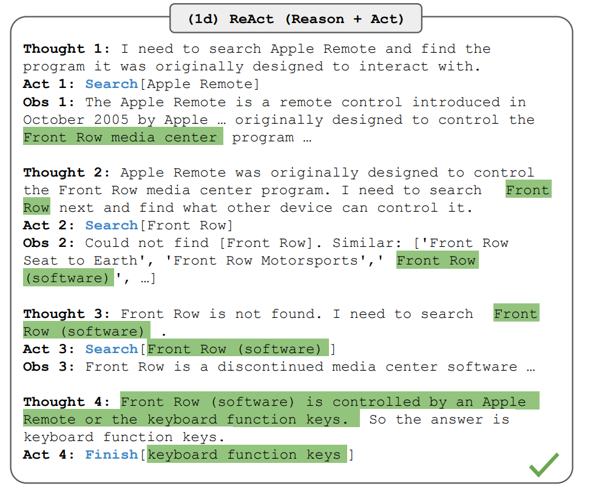

# LLM File Explorer with ReAct

ReAct is a technique that allows an LLM Model to interact with the environment as if it was an Agent. With this technique, we seek to develop a File Explorer agent capable of finding information across file systems, with a guided search that aims to improve the velocity to find highly reliable answers.

Also, one of the principal problems of modern-day information searchers such as RAG techniques is that they require preprocessing all the available information in order to give proper answers, which can be problematic in environments where data is constantly changing or with highly large quantities of data where the search can be slow.

Original paper: [ReAct: Synergizing Reasoning and Acting in Language Models](https://arxiv.org/abs/2210.03629)

## Installation
In order to execute the code, first install the necessary requirements. If you have a CUDA GPU, use the PyTorch tool to install the correct version for your system.
PyTorch installation tool: [Tool](https://pytorch.org/get-started/locally/)

Install with: `pip install -r requirements.txt`

## Execution
To run the program, execute 'example.py' by running `python example.py` in your terminal 